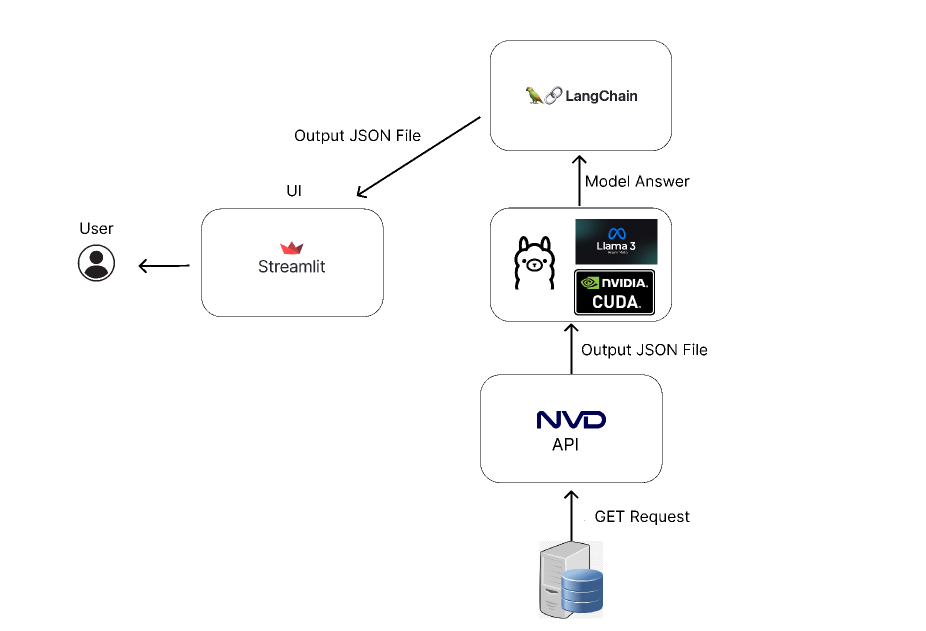

# CVE to CPE Converter

## Description

The CVE to CPE Converter is a Python application developed to automatically generate CPE (Common Platform Enumeration) records from CVE descriptions using a language model (LLM). This project is designed to facilitate the management of security vulnerabilities by easily and quickly converting CVE information into a standardized CPE format.

## Features

- **Up-to-Date CVE Data**: Processes daily updated CVE data.
- **CPE Conversion**: Generates CPE records from CVE descriptions.
- **Data Storage**: Stores data in local daily JSON files.
- **Ollama Integration**: Utilizes Ollama for processing CVE and CPE data.
- **Streamlit Application**: Provides a web-based interface.

## Project Flow Chart




## Requirements

The following requirements are necessary for the proper functioning of this project:

### Python and Virtual Environment

1. **Python**: Requires Python 3.6 or higher.
2. **Virtual Environment**: It is recommended to create an isolated Python environment to run the project.

### Language Model Usage

- **Ollama**: Requires the Ollama language model for processing CVE and CPE data. Version: 0.3.0
- **Llama3**: With 8B parameters.

### Installation

Follow these steps to set up the project on your local machine:

1. **Clone the Repository**:

    ```bash
    git clone https://github.com/BilgeNurBekar/CVE2CPE.git
    cd CVE2CPE
    ```

2. **Create and Activate a Virtual Environment**:

    - **Windows**:

        ```bash
        python -m venv venv
        venv\Scripts\activate
        ```

    - **Linux/MacOS**:

        ```bash
        python3 -m venv venv
        source venv/bin/activate
        ```

3. **Install Required Libraries**:

    ```bash
    pip install -r requirements.txt
    ```

4. **Configuration**:

    - Create a `.env` file and define the necessary environment variables. [Request an API key from NVD](https://nvd.nist.gov/developers/request-an-api-key)
    - Visit: [Ollama](https://ollama.com/)

## Usage

### Running the Project

Run the project in different terminals:


```bash
py dailyCVE2cpe.py 
```

```bash
streamlit run CVEvisualizaiton.py --serve localhost 
```


